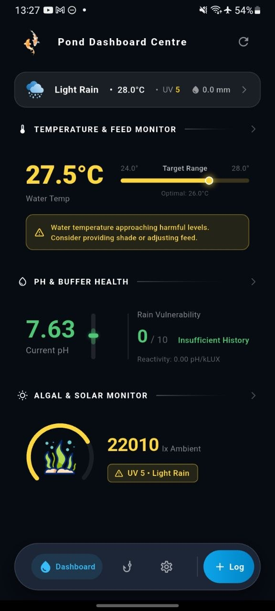
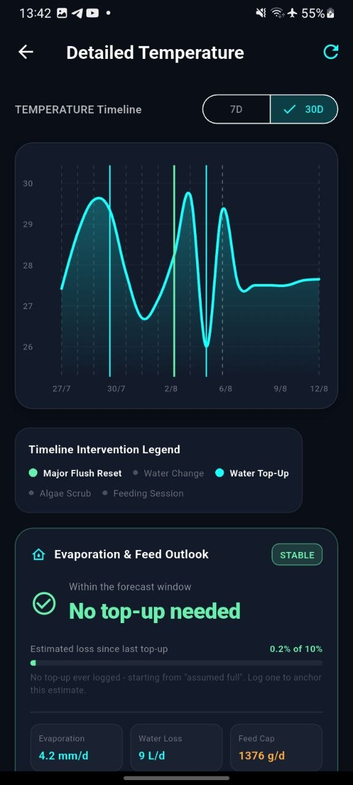
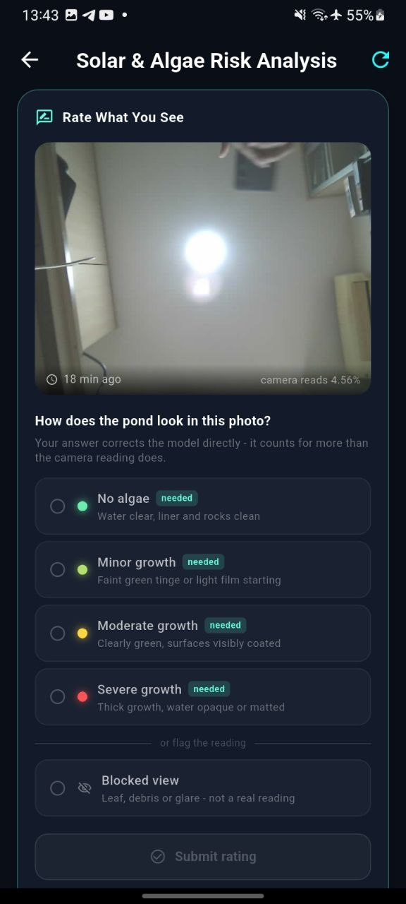
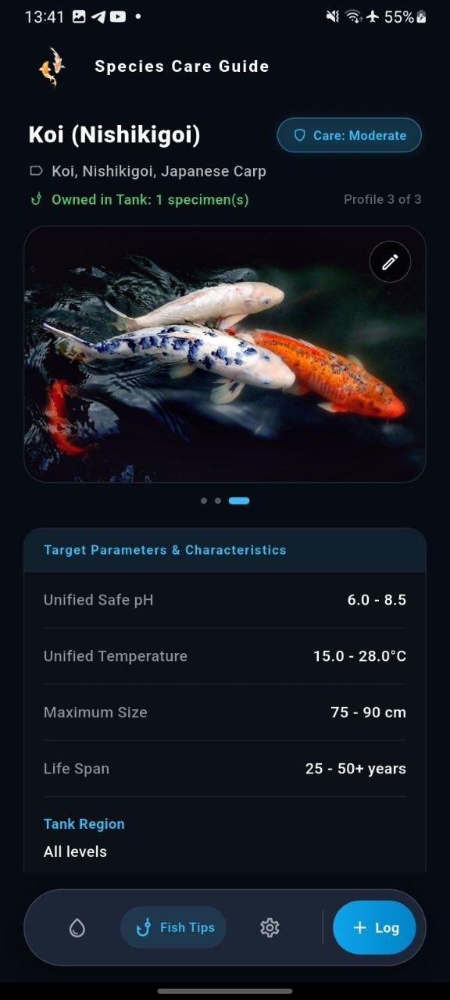
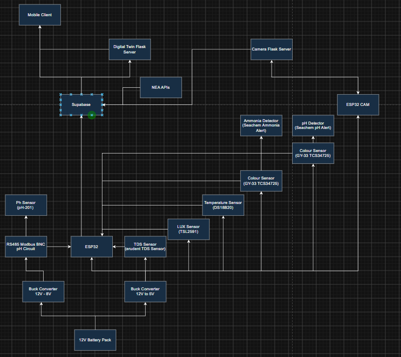
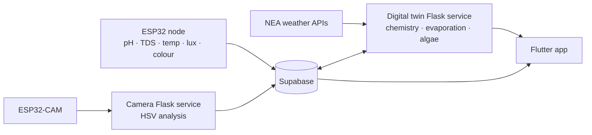
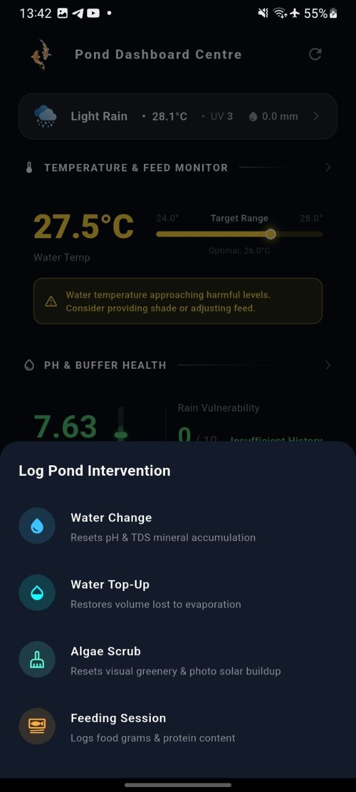
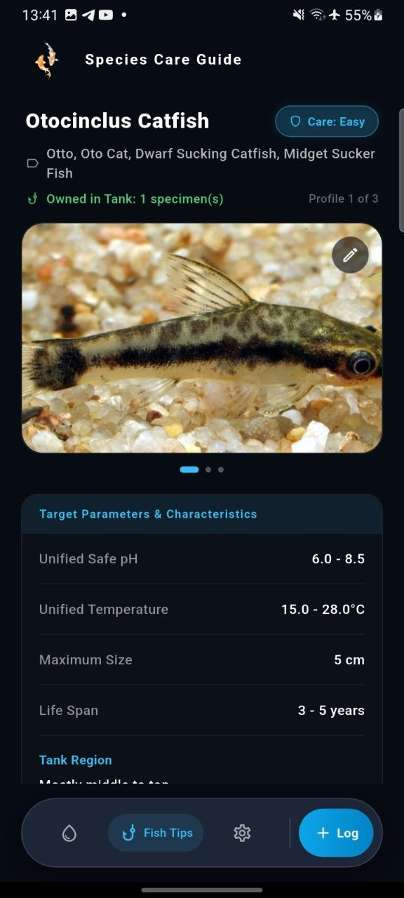
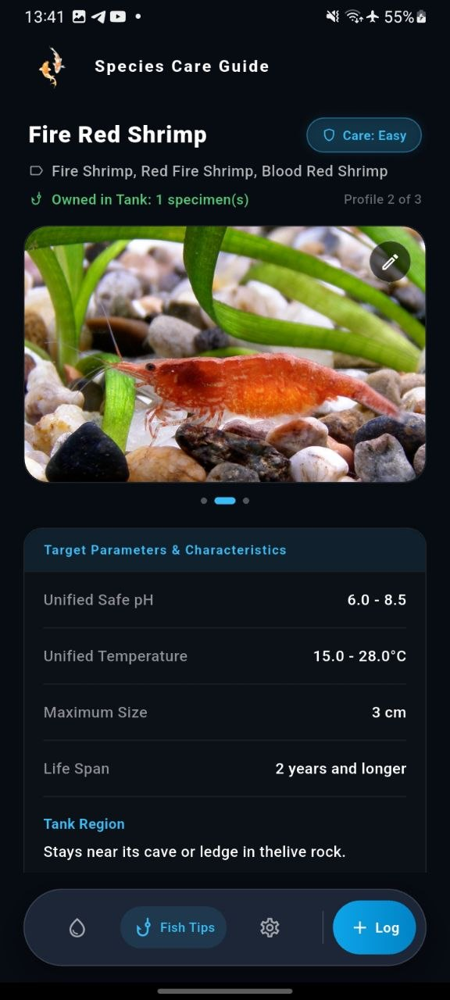

# OutdoorKoi

**A forecast-aware telemetry and advisory system for outdoor koi ponds.**
ESP32 sensor nodes → Supabase → a Flask "digital twin" that simulates pond chemistry,
evaporation and algal growth → a Flutter app that turns the model into plain-language
actions: *"no top-up needed this window"*, *"water temperature approaching harmful levels,
consider adjusting feed"*, *"scrubbing today buys you 9 clear days"*.

Final-year project, NTU EEE · Edwin Tan Kai Jie

<p align="center">
  
  
  
  
</p>

---

## The idea

Commercial pond controllers cost more than most hobbyists will spend, so the affordable
alternative is manual dip-testing — laborious, and always reactive. This project tests
whether a handful of cheap probes plus public weather data can do better.

The finding that shaped the whole system: across **2,838 days** of historical Singapore
rainfall, **20% of days deliver more rain in one day than a small pond's entire adverse
threshold**. Same-day sensing is structurally incapable of helping when the warning and
the crash land on the same day — so the system is built around *forecast lead time*
rather than faster sensors.

## Hardware



A single 12 V battery pack feeds two buck rails: 8 V for the RS485 pH front-end, 5 V for
everything else. Two independent ESP32 nodes report to their own Flask services so a
camera fault can't take telemetry down with it.

| Measurement | Device | Notes |
|---|---|---|
| pH | pH-201 probe over RS485 Modbus (BNC front-end) | Industrial probe, isolated 8 V rail |
| TDS | Analogue TDS probe | Doubles as the evaporation cross-check |
| Water temperature | DS18B20 | 1-Wire |
| Light | TSL2591 | Drives the algal favourability term |
| **Ammonia** | **GY-33 / TCS34725 colour sensor reading a Seachem Ammonia Alert badge** | Colorimetric readout of a consumable test badge — continuous ammonia sensing at a few dollars instead of a few hundred |
| **pH cross-check** | **GY-33 / TCS34725 reading a Seachem pH Alert badge** | Independent second opinion on the electrode |
| Imaging | ESP32-CAM | Green-ratio extraction for the algae model |

Reading colorimetric test badges with a colour sensor is the part I'd point at first: it
gives the chemistry model a real ammonia observable without a lab-grade ion-selective
electrode, which is the single largest cost line in comparable systems.

## Software architecture



| Layer | Stack | Role |
|---|---|---|
| Firmware | C++ / Arduino, ESP32 + ESP32-CAM | Sample, capture, deep-sleep between reads |
| Data | Supabase / Postgres | Time series, image analysis, intervention log, persisted engine snapshots |
| Modelling | Python, Flask, APScheduler | Stateful per-pond simulation, re-assessed on every event and on a 15-minute poll |
| Client | Flutter / Dart | Charts, intervention logging, one server-computed lookahead card per metric |

### Three engines, grounded three different ways

| Domain | Grounding | Method |
|---|---|---|
| **Chemistry** | Mass balance | TAN → NO₂ → NO₃ pools advanced by exponential nitrification kinetics with a temperature multiplier. Feeding adds TAN; water changes dilute. Probes act as a plausibility gate, not the ammonia source. |
| **Evaporation** | Physical model | Penman aerodynamic term from forecast temperature, humidity and wind — then cross-checked against the TDS concentration slope the probe independently measured. |
| **Algae** | Empirical self-calibration | Growth rate fitted from camera green-ratio history, divided by the favourability that actually prevailed, re-applied to forecast conditions and integrated logistically. Thresholds are relative to each pond's own baseline, so they transfer across camera framings. |

Each domain reports its own confidence, because they are not equally trustworthy.

## What the app does

<p align="center">
  
  
  
</p>

- **Dashboard** — three monitors (temperature/feed, pH/buffer, algae/solar) over a live
  weather strip, each with a plain-language advisory rather than a raw number.
- **Intervention log** — water change, top-up, algae scrub and feeding all push straight
  into the twin, which re-assesses and returns the updated state for an optimistic UI
  update. Logged events are then overlaid as markers on every historical chart, so a
  spike always has a visible cause.
- **Lookahead cards** — evaporation and feed outlook ("no top-up needed", estimated loss
  since last top-up, mm/day, L/day, feed cap), buffer status, algae scrub timing.
- **Human-in-the-loop vision correction** — the algae screen shows the latest frame with
  the camera's own reading and asks the keeper to rate it, including a *blocked view* flag.
  A human label outranks the camera reading in the fit, which is how the model recovers
  from glare, debris and framing changes.
- **Species care guide** — per-species tolerances resolved into a **unified safe range**
  across everything actually stocked, so the advisory thresholds follow the tank rather
  than a generic default.

## Engineering highlights

- **Forward projection reuses the live kinetics.** `project_forward()` and live ingestion
  share one stepping function and one risk-scoring function, so a forecast can never
  silently diverge from the model that produced the current state.
- **Sensor gating.** Per-channel range checks, stale-run detection, rate-of-change limits
  suppressed around logged water changes (so a legitimate volume event isn't flagged as
  drift), and a "probe out of water" heuristic.
- **Cross-domain coupling.** Nitrate is algae's nitrogen source, so the algae forecast
  consumes the chemistry engine's projected NO₃ trajectory — 0.5 ppm gives 12 days to
  action, 60 ppm gives 3.
- **Contract testing across the language boundary.** A test suite extracts all 52
  `json['key']` literals from the Dart models and asserts each exists in real engine
  output — `json['typo']` is valid Dart that silently yields null at runtime.
- **~280 assertions** across four suites covering projection invariants, Penman
  plausibility, growth-rate recovery against synthetic data, obstruction handling, and
  image state-machine regressions.

## Validation

The modelling is backed by an offline study over historical NEA data, deliberately
independent of the hardware.

**Weather forecasts turned out to be worth far less than expected — and that's the
result.** Eight phases of testing found no usable forecast signal for pond chemistry:
100 mm of rain moves alkalinity 8%, while one ordinary day of fish load moves it 4%. The
line was closed and reported as a finding rather than buried.

What *did* survive validation over 2,302 days, holding in all 7 individual years:

| Message | Fires on | Precision | Verified against |
|---|---|---|---|
| "Clear day — good for maintenance" | 15.6% of days | **0.861** | Measured rain-gauge observations |
| "Heat is holding — cut the ration" | 11.0% of days | **0.842** | Composite pond-stress index |

Both beat a permutation control (0.500 and 0.301 respectively, 2,000 shuffles). The second
requires *both* sensor and forecast — neither alone reaches it. And the two messages carry
the same insight from opposite sides: **the best days to work on the pond are the worst
days for the fish in it.**

## Repository layout

```
Backend/DigitalTwin/     Flask API, three engines, Supabase persistence, tests
Backend/Camera/          Camera service, HSV analysis, adaptive capture scheduling
Firmware/                ESP32 sensor node + ESP32-CAM
App/                     Flutter client
PythonSimulatorProject/  Historical simulation study and forecast validation
docs/                    Design notes, experiment protocols, screenshots
```

## Running it

**Backend**

```bash
cd Backend/DigitalTwin
python -m venv .venv && source .venv/bin/activate
pip install -r requirements.txt
cp .env.example .env      # SUPABASE_URL, SUPABASE_KEY, NEA_BASE_URL
python app.py
```

**App**

```bash
cd App && flutter pub get && flutter run
```

**Simulation study**

```bash
cd PythonSimulatorProject
python localisation.py                 # builds the dataset — run first
python nea_final_validation.py         # forecast claim validation
python simulator.py                    # interactive four-arm simulator
```

### API

| Method | Route | |
|---|---|---|
| `POST` | `/event/{feeding,water_change,top_up,algal_scrub}` | Mutates state, re-assesses, returns the fresh assessment |
| `GET` | `/assessment/<user_id>` | Current Green / Amber / Red + advisory text |
| `GET` | `/forecast/<user_id>` | Chemistry: first-breach day + full trajectory |
| `GET` | `/forecast/evaporation/<user_id>` | Next top-up, feed-ration guidance |
| `GET` | `/forecast/algae/<user_id>` | Next scrub, and what scrubbing today buys you |

Forecast endpoints are read-only, evaluate the already-in-breach case before simulating
forward, and return `422` with a human-readable reason rather than projecting from
insufficient history.

## Scope

Research prototype, advisory only — no actuation, one instrumented pond, Singapore
climate. Water temperature is currently modelled from air temperature rather than
measured, and the evaporation and algae models are calibrated rather than fitted to
ground truth; absolute magnitudes carry meaningful uncertainty even where the relative
signals are robust. The API is unauthenticated and single-process by design at this
stage, and is not intended to run outside a development network.

## Data

Singapore National Environment Agency, via the data.gov.sg real-time weather APIs.
Historical daily rainfall from the Admiralty station (2009–2017, 2,838 days); forecast
archive and reconstructed rainfall (2020–2026, 2,302 days). Gap days and missing readings
are disclosed rather than imputed.

## Licence

TODO
