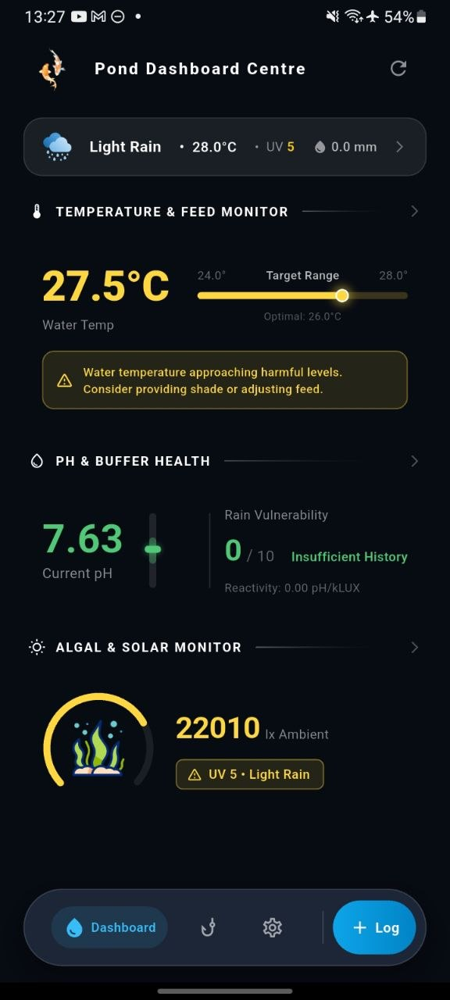
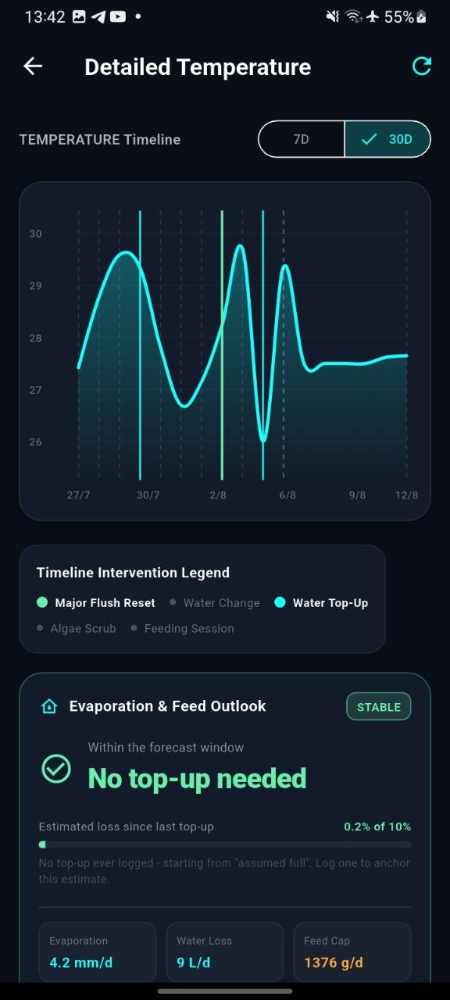
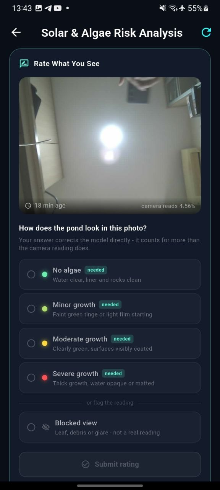
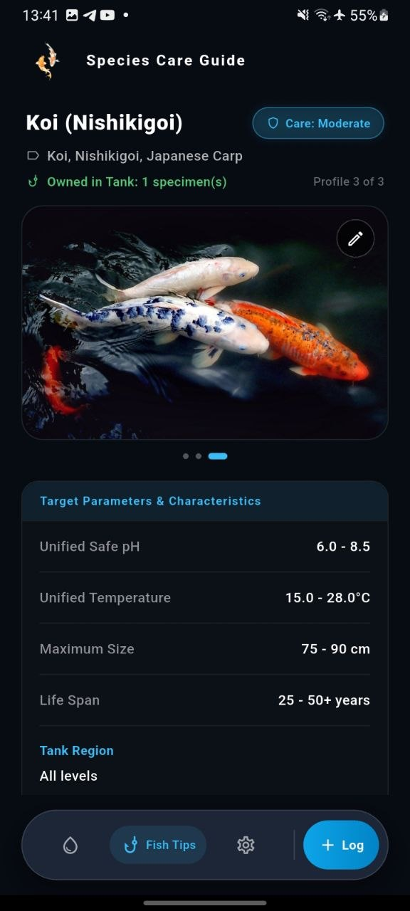
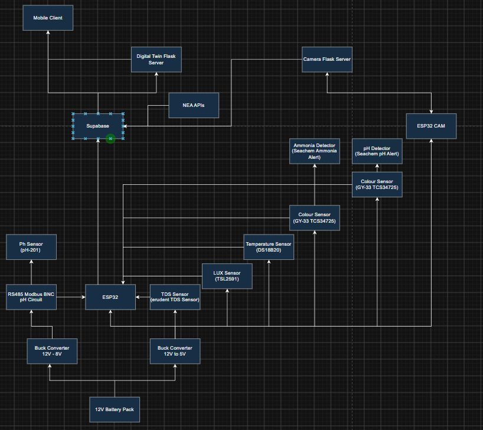
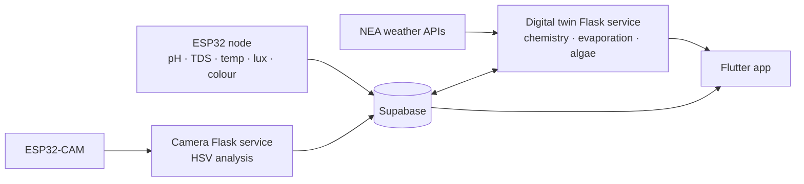
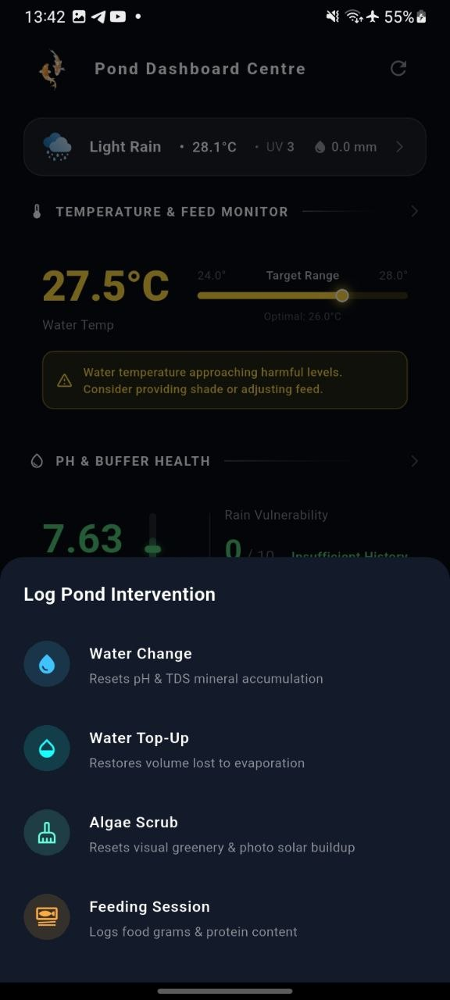
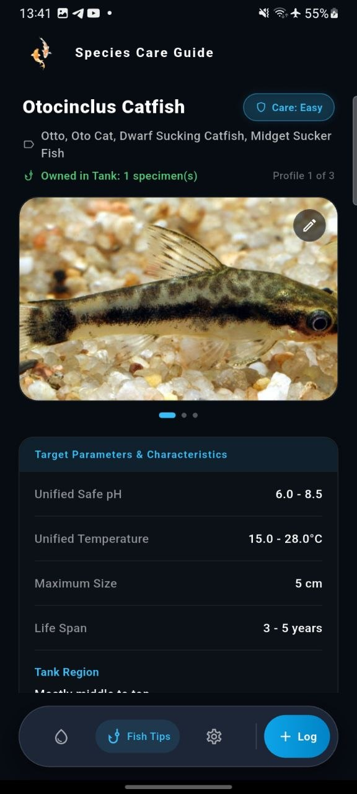
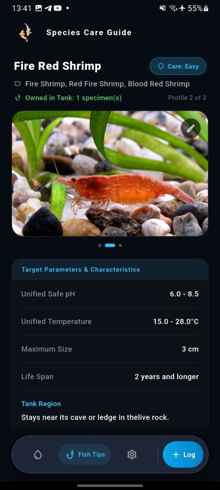

# OutdoorKoi

**A forecast-aware telemetry and advisory system for outdoor koi ponds.**
ESP32 sensor nodes → Supabase → a Flask "digital twin" that simulates pond chemistry,
evaporation and algal growth → a Flutter app that turns the model into plain-language
actions: *"no top-up needed this window"*, *"water temperature approaching harmful levels,
consider adjusting feed"*, *"scrubbing today buys you 9 clear days"*.

Final-year project, NTU EEE · Edwin Tan Kai Jie

<p align="center">
  
  
  
  
</p>

---

## The idea

Commercial pond controllers cost more than most hobbyists will spend, so the affordable
alternative is manual dip-testing — laborious, and always reactive. This project tests
whether a handful of cheap probes plus public weather data can do better.

The finding that shaped the whole system: across **2,838 days** of historical Singapore
rainfall, **20% of days deliver more rain in one day than a small pond's entire adverse
threshold**. Same-day sensing is structurally incapable of helping when the warning and
the crash land on the same day — so the system is built around *forecast lead time*
rather than faster sensors.

## Hardware



A single 12 V battery pack feeds two buck rails: 8 V for the RS485 pH front-end, 5 V for
everything else. Two independent ESP32 nodes report to their own Flask services so a
camera fault can't take telemetry down with it.

| Measurement | Device | Notes |
|---|---|---|
| pH | pH-201 probe over RS485 Modbus (BNC front-end) | Industrial probe, isolated 8 V rail |
| TDS | Analogue TDS probe | Doubles as the evaporation cross-check |
| Water temperature | DS18B20 | 1-Wire |
| Light | TSL2591 | Drives the algal favourability term |
| **Ammonia** | **GY-33 / TCS34725 colour sensor reading a Seachem Ammonia Alert badge** | Colorimetric readout of a consumable test badge — continuous ammonia sensing at a few dollars instead of a few hundred |
| **pH cross-check** | **GY-33 / TCS34725 reading a Seachem pH Alert badge** | Independent second opinion on the electrode |
| Imaging | ESP32-CAM | Green-ratio extraction for the algae model |

Reading colorimetric test badges with a colour sensor is the part I'd point at first: it
gives the chemistry model a real ammonia observable without a lab-grade ion-selective
electrode, which is the single largest cost line in comparable systems.

## Software architecture


```mermaid
flowchart LR
    A[ESP32 node<br/>pH · TDS · temp · lux · colour] --> C[(Supabase)]
    B[ESP32-CAM] --> G[Camera Flask service<br/>HSV analysis]
    G --> C
    E[NEA weather APIs] --> D[Digital twin Flask service<br/>chemistry · evaporation · algae]
    C <--> D
    D --> F[Flutter app]
    C --> F
```

| Layer | Stack | Role |
|---|---|---|
| Firmware | C++ / Arduino, ESP32 + ESP32-CAM | Sample, capture, deep-sleep between reads |
| Data | Supabase / Postgres | Time series, image analysis, intervention log, persisted engine snapshots |
| Modelling | Python, Flask, APScheduler | Stateful per-pond simulation, re-assessed on every event and on a 15-minute poll |
| Client | Flutter / Dart | Charts, intervention logging, one server-computed lookahead card per metric |

### Three engines, grounded three different ways

| Domain | Grounding | Method |
|---|---|---|
| **Chemistry** | Mass balance | TAN → NO₂ → NO₃ pools advanced by exponential nitrification kinetics with a temperature multiplier. Feeding adds TAN; water changes dilute. Probes act as a plausibility gate, not the ammonia source. |
| **Evaporation** | Physical model | Penman aerodynamic term from forecast temperature, humidity and wind — then cross-checked against the TDS concentration slope the probe independently measured. |
| **Algae** | Empirical self-calibration | Growth rate fitted from camera green-ratio history, divided by the favourability that actually prevailed, re-applied to forecast conditions and integrated logistically. Thresholds are relative to each pond's own baseline, so they transfer across camera framings. |

Each domain reports its own confidence, because they are not equally trustworthy.

## What the app does

<p align="center">
  
  
  
</p>

- **Dashboard** — three monitors (temperature/feed, pH/buffer, algae/solar) over a live
  weather strip, each with a plain-language advisory rather than a raw number.
- **Intervention log** — water change, top-up, algae scrub and feeding all push straight
  into the twin, which re-assesses and returns the updated state for an optimistic UI
  update. Logged events are then overlaid as markers on every historical chart, so a
  spike always has a visible cause.
- **Lookahead cards** — evaporation and feed outlook ("no top-up needed", estimated loss
  since last top-up, mm/day, L/day, feed cap), buffer status, algae scrub timing.
- **Human-in-the-loop vision correction** — the algae screen shows the latest frame with
  the camera's own reading and asks the keeper to rate it, including a *blocked view* flag.
  A human label outranks the camera reading in the fit, which is how the model recovers
  from glare, debris and framing changes.
- **Species care guide** — per-species tolerances resolved into a **unified safe range**
  across everything actually stocked, so the advisory thresholds follow the tank rather
  than a generic default.

## Engineering highlights

- **Forward projection reuses the live kinetics.** `project_forward()` and live ingestion
  share one stepping function and one risk-scoring function, so a forecast can never
  silently diverge from the model that produced the current state.
- **Sensor gating.** Per-channel range checks, stale-run detection, rate-of-change limits
  suppressed around logged water changes (so a legitimate volume event isn't flagged as
  drift), and a "probe out of water" heuristic.
- **Cross-domain coupling.** Nitrate is algae's nitrogen source, so the algae forecast
  consumes the chemistry engine's projected NO₃ trajectory — 0.5 ppm gives 12 days to
  action, 60 ppm gives 3.
- **Contract testing across the language boundary.** A test suite extracts all 52
  `json['key']` literals from the Dart models and asserts each exists in real engine
  output — `json['typo']` is valid Dart that silently yields null at runtime.
- **~280 assertions** across four suites covering projection invariants, Penman
  plausibility, growth-rate recovery against synthetic data, obstruction handling, and
  image state-machine regressions.

## Validation

The modelling is backed by an offline study over historical NEA data, deliberately
independent of the hardware.

**Weather forecasts turned out to be worth far less than expected — and that's the
result.** Eight phases of testing found no usable forecast signal for pond chemistry:
100 mm of rain moves alkalinity 8%, while one ordinary day of fish load moves it 4%. The
line was closed and reported as a finding rather than buried.

What *did* survive validation over 2,302 days, holding in all 7 individual years:

| Message | Fires on | Precision | Verified against |
|---|---|---|---|
| "Clear day — good for maintenance" | 15.6% of days | **0.861** | Measured rain-gauge observations |
| "Heat is holding — cut the ration" | 11.0% of days | **0.842** | Composite pond-stress index |

Both beat a permutation control (0.500 and 0.301 respectively, 2,000 shuffles). The second
requires *both* sensor and forecast — neither alone reaches it. And the two messages carry
the same insight from opposite sides: **the best days to work on the pond are the worst
days for the fish in it.**

## Repository layout

```
Backend/koi/                        Python package `koi` (see Backend/README_INTEGRATION.md)
Backend/koi/models/                 The three engines and the pond orchestrator (pure, no I/O)
Backend/koi/storage/                Storage interface: Supabase and in-memory implementations
Backend/koi/api/                    Digital twin Flask API
Backend/koi/worker/                 Environmental poller
Backend/koi/camera/                 Camera service, HSV analysis, adaptive capture scheduling
Backend/koi/weather/                NEA ingestion job and weather history reads (docs/weather-ingestion.md)
Backend/koi/dev/                    Local development stack on seeded demo data (docs/dev.md)
Backend/koi/tools/                  Owner maintenance commands (rebuild a pond's twin from its history)
Backend/fixtures/demo_pond/         The demo seed and the script that builds it
Backend/koi/settings.py             Every environment value, typed (pydantic-settings)
Backend/tests/                      Backend tests, mirroring the package
Embedded/sensor_node/               ESP32 sensor node, networked build (uploads to Supabase)
Embedded/sensor_bench/              ESP32 sensor node, serial-only bench build with service mode
Embedded/camera_node/               ESP32-CAM capture and upload
Embedded/bench_tests/               Single-purpose pH bench sketches
Embedded/libraries/koi_sensing/     Shared sensor maths (Arduino library)
Embedded/tests/                     Host-side tests for koi_sensing
MobileUI/mobile_app/                Flutter client
supabase/migrations/                Database schema as numbered SQL migrations (see supabase/README.md)
PythonSimulatorProject/             Historical simulation study and forecast validation
analysis/tds_viability/             Offline analysis of the TDS bench tests T1 to T4 (report Section 4.4.3.1)
docs/                               Design notes, experiment protocols, screenshots
archive/pre-refactor/               Superseded code, kept for traceability only
```

## Running it

**Checks**

```bash
pip install -e "Backend[dev]"
python tools/check.py all          # or backend | firmware | mobile
```

Runs ruff, mypy and pytest for the backend; the firmware host tests (g++)
and, if `arduino-cli` is installed, ESP32 compiles of `sensor_bench`,
`sensor_node` and `camera_node`; and `flutter analyze` and `flutter test`.
A missing tool prints `SKIP`; `--strict` (used by CI in
`.github/workflows/ci.yml`) makes it a failure. `python tools/check.py
database` runs the migration rehearsal, the SQL tests and the dev stack
against a local Supabase stack; it is separate from `all` because it
rebuilds the local database (docs/dev.md).

**Offline, on demo data**

```bash
cd Backend
python -m koi.dev            # API :8080, camera :5000 and the worker on a seeded demo pond
python -m koi.dev --check    # start, validate the API against the OpenAPI document, exit
docker compose up --build    # the same, in a container (from the repository root)
```

No live service, phone or hardware is needed. How to point the app at
it, the local Supabase profile and the Compose profiles:
[docs/dev.md](docs/dev.md).

**Backend**

```bash
cd Backend
python -m venv .venv && source .venv/bin/activate
pip install -e ".[dev]"
cp .env.example .env      # SUPABASE_URL, SUPABASE_SERVICEROLE_KEY, KOI_ENV, ...
python -m koi.api         # digital twin API on :8080 (runs the poller too when KOI_ENV=development)
python -m koi.worker      # the poller on its own, for any other KOI_ENV
python -m koi.camera      # camera service on :5000
python -m koi.weather live   # one NEA fetch into the weather caches and history
python -m koi.tools.rebuild --pond N --dry-run   # rebuild a pond's twin from its history and compare
```

`koi.tools.rebuild` builds a fresh twin from the pond profile, the logged
interventions, the ingested sensor rows, camera frames, algae ratings and
the weather history as of each poll, and prints it beside the stored
snapshot (pool values, loss, algae level, last assessments) with the
model, profile and camera-mask versions, the input cutoff and any interval
without weather history. `--since YYYY-MM-DD` starts it at that local
date. Without `--dry-run` it saves the result as the pond's next snapshot
version; that replaces the live state, so run it as a deliberate
maintenance step (details in `Backend/koi/tools/rebuild.py`).

Python 3.11 or newer. `Backend/requirements.lock` pins every dependency;
`Backend/requirements.txt` installs those pins plus the package (used by
the camera on PythonAnywhere). Where each service runs today (camera on
PythonAnywhere; API and worker on the owner's laptop until #83), and how to
update or roll back the camera: "Where each service runs" in
`Backend/README_INTEGRATION.md`.

**App**

```bash
cd MobileUI/mobile_app && flutter pub get
cp env/dev.json.example env/dev.json   # fill in every value
flutter run --dart-define-from-file=env/dev.json
```

A build without these values opens on a configuration error screen that
names each missing value.

**Firmware**

Copy or symlink `Embedded/libraries/koi_sensing` into your Arduino
`libraries/` folder (or pass `--libraries Embedded/libraries` to
`arduino-cli compile`), then open a sketch folder under `Embedded/`.
`sensor_node` and `camera_node` read Wi-Fi, server and device credentials
from a gitignored `secrets.h`: copy `secrets.h.example` in the sketch
folder to `secrets.h` and fill it in. Without it the sketch stops at
compile time with an `#error` naming the example file.

`Backend/.env.example` lists every variable the backend reads; all of them
are loaded through `koi/settings.py`.

Error tracking: set `SENTRY_DSN` in `Backend/.env` (API, worker and camera
service) and in the app's `env/*.json` to send errors to Sentry; without it
nothing is sent. Events carry the environment and release (backend
`koi@<version>+twin.<snapshot version>`, app `sg.edu.ntu.outdoorkoi@<version>`),
and location, email addresses, tokens and request bodies are removed first
(`Backend/koi/error_tracking.py`, `MobileUI/mobile_app/lib/config/error_tracking.dart`).
The backend check scans tracked files for committed credentials (Wi-Fi
password assignments, device-token literals, JWT-shaped strings,
service-role references) outside `.example` files and `archive/`.
Host-side tests for the shared library:

```bash
mkdir -p build
g++ -std=c++17 -I Embedded/libraries/koi_sensing/src Embedded/tests/test_all.cpp -o build/fw_tests && ./build/fw_tests
```

**Simulation study**

```bash
cd PythonSimulatorProject
python localisation.py                 # builds the dataset — run first
python nea_final_validation.py         # forecast claim validation
python simulator.py                    # interactive four-arm simulator
```

### API

Every route is under `/v1`; the full description is
[docs/api/openapi.yaml](docs/api/openapi.yaml) (generated, see
[docs/api/README.md](docs/api/README.md)). The unversioned paths the app
still calls (`/assessment/...`, `/forecast/...`, `/events/...`,
`/ratings/...`) are deprecated aliases and answer with a `Deprecation`
header. GET responses carry an `ETag` and answer `If-None-Match` with 304.

| Method | Route | |
|---|---|---|
| `GET` | `/v1/ponds/{pond}/dashboard` | Everything the dashboard shows in one response: each channel's latest reading with its own times, the three assessments, next actions, weather now and the forecasts |
| `POST` | `/v1/ponds/{pond}/events/{feeding,water-change,top-up,algal-scrub,salt,filter-clean}` | Mutates state, re-assesses, returns the fresh assessments |
| `GET` | `/v1/ponds/{pond}/assessments[/chemistry,/evaporation,/algae]` | Current Green / Amber / Red + advisory text |
| `GET` | `/v1/ponds/{pond}/forecasts/chemistry` | Chemistry: first-breach day + full trajectory |
| `GET` | `/v1/ponds/{pond}/forecasts/evaporation` | Next top-up, feed-ration guidance |
| `GET` | `/v1/ponds/{pond}/forecasts/algae` | Next scrub, and what scrubbing today buys you |
| `GET`, `PUT` | `/v1/ponds/{pond}/profile` | Pond profile (volume, depth, fish, tap water, aeration); PUT adds a row effective now or at `effective_from`, earlier rows are kept |
| `GET`, `PUT` | `/v1/ponds/{pond}/camera/mask` | Water mask for the camera's green ratio: a polygon of `[x, y]` points as fractions of the frame (3 to 64 points, at least 1% of the frame). Each PUT is a new mask version; the camera restarts its smoothed baseline on the first frame with a new version |
| `GET` | `/v1/ponds/{pond}/devices` | Sensor node and camera health: last seen (receipt time), expected interval, contacts received and missed in 24 hours, battery trend from `battery_mv`, last reset reason, and each channel's last usable sample time. Every assessment also carries `data_confidence` (high, reduced, low) with its reasons |
| `GET` | `/health`, `/ready` (also under `/v1`), `/metrics` | Liveness; readiness (storage and the poller, 503 when not ready); Prometheus metrics |

Forecast endpoints are read-only, evaluate the already-in-breach case before simulating
forward, and return `422` with a human-readable reason rather than projecting from
insufficient history.

## Scope

Research prototype, advisory only — no actuation, one instrumented pond, Singapore
climate. Water temperature is currently modelled from air temperature rather than
measured, and the evaporation and algae models are calibrated rather than fitted to
ground truth; absolute magnitudes carry meaningful uncertainty even where the relative
signals are robust. The API is unauthenticated and single-process by design at this
stage, and is not intended to run outside a development network.

## Data

Singapore National Environment Agency, via the data.gov.sg real-time weather APIs.
Historical daily rainfall from the Admiralty station (2009–2017, 2,838 days); forecast
archive and reconstructed rainfall (2020–2026, 2,302 days). Gap days and missing readings
are disclosed rather than imputed.

## Licence

TODO
